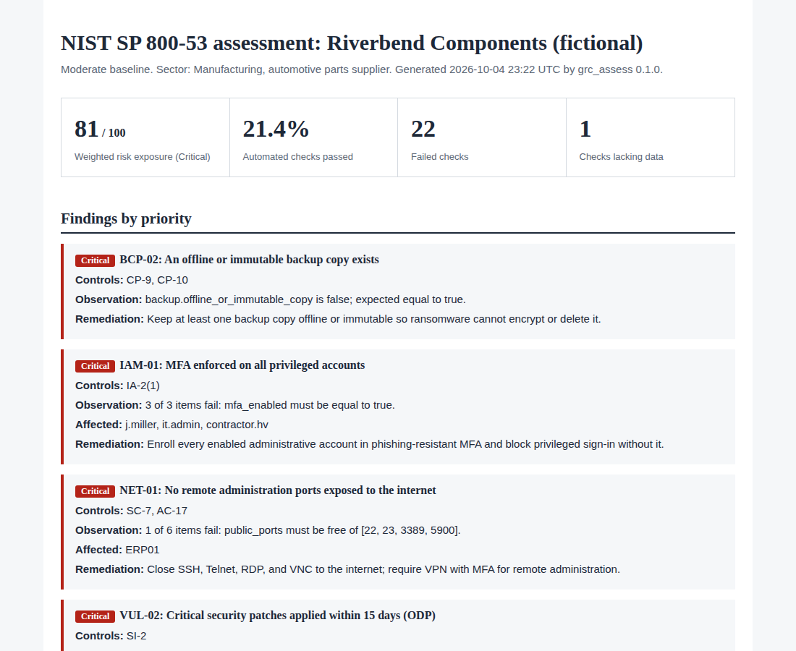

# NIST SP 800-53 Assessment Tool

[](https://github.com/Edward-Owusu/Nist-800-53-assessment-tool/actions/workflows/tests.yml)
[](LICENSE)

An open-source tool that checks an organization's system configuration against the **NIST SP 800-53 Rev. 5** low, moderate, or high control baseline and produces a prioritized, auditor-ready remediation report.

It is built for small and mid-sized organizations, such as manufacturers, warehouses, and suppliers in critical U.S. supply chains, that need to measure their security posture against a recognized federal standard but do not have a dedicated compliance team or budget for commercial GRC platforms.



## Why this matters

NIST SP 800-53 is the security and privacy control catalog used for U.S. federal information systems, and it underpins frameworks that reach far into the private sector, including FedRAMP for cloud services. Its control baselines in NIST SP 800-53B define what "secure enough" means for systems of low, moderate, and high impact.

Large enterprises assess against these controls with commercial platforms and full-time audit staff. Small and mid-sized organizations, many of which supply manufacturers, food distributors, and other critical infrastructure, usually cannot. Their gaps, such as administrator accounts without multi-factor authentication, internet-exposed remote desktop, or backups that ransomware can reach, become entry points into the larger supply chains they serve.

This tool lowers that barrier. It turns the control catalog into concrete, automated checks, explains each finding in plain language, maps it to the specific control it affects, and ranks remediation by severity so a small team knows what to fix first.

## What it does

- Runs **29 automated checks** mapped to **32 NIST SP 800-53 Rev. 5 controls** across 11 control families.
- Filters controls by **baseline** (low, moderate, or high) following NIST SP 800-53B.
- Rolls check results up to control status: implemented, partially implemented, not implemented, or not assessed.
- Calculates a **compliance percentage** and a **severity-weighted risk exposure score** (see [methodology](docs/methodology.md)).
- Names the **specific accounts and systems** behind each finding.
- Treats missing evidence conservatively: it never marks a control as passing without data.
- Produces reports in **HTML, Markdown, CSV, and JSON**.
- Includes an interactive **Streamlit dashboard** and a **command-line tool** suitable for scheduled runs or CI pipelines.
- The core engine has **no third-party dependencies**, and checks are defined in a plain JSON file that auditors can read and extend without writing code.

## Quick start

Requires Python 3.10 or later.

```bash
git clone https://github.com/Edward-Owusu/Nist-800-53-assessment-tool.git
cd Nist-800-53-assessment-tool
pip install -e .

# Assess the sample small manufacturer against the moderate baseline
grc-assess samples/example_manufacturer_weak.json --baseline moderate --format html md --out reports
```

Example output:

```
Riverbend Components (fictional) | Moderate baseline
Compliance: 21.4% | Risk exposure: 81.2/100 (Critical)
Checks: 6 passed, 22 failed, 1 not assessed
  [CRITICAL] BCP-02 An offline or immutable backup copy exists
  [CRITICAL] IAM-01 MFA enforced on all privileged accounts
  [CRITICAL] NET-01 No remote administration ports exposed to the internet
  [CRITICAL] VUL-02 Critical security patches applied within 15 days (ODP)
  [HIGH    ] CRY-02 Disk encryption on systems storing sensitive data
  ... and 17 more in the report
```

Open `reports/example_manufacturer_weak_moderate.html` in a browser for the full report. Pre-generated reports are in [docs/example-reports](docs/example-reports).

### Dashboard

```bash
pip install -r requirements.txt
streamlit run app/streamlit_app.py
```

### Use in automation

`--fail-on <severity>` makes the tool exit with code 2 when a finding at or above that severity exists, so it can gate a deployment pipeline or alert on a scheduled run:

```bash
grc-assess my_config.json --fail-on critical
```

## Assessing your own organization

1. Copy `samples/config_template.json`.
2. Fill it in from your directory, endpoint management, backup, and network tools. The [configuration reference](docs/configuration-reference.md) lists every field and the control it supports.
3. Remove any section you cannot provide. Those checks are reported as not assessed.
4. Run the tool and review the findings with whoever owns each system.

## Controls covered

| Family | Controls |
|---|---|
| Access Control (AC) | AC-2, AC-2(3), AC-3\*, AC-6, AC-7, AC-11, AC-17 |
| Awareness and Training (AT) | AT-2 |
| Audit and Accountability (AU) | AU-2, AU-6, AU-11 |
| Configuration Management (CM) | CM-2, CM-6, CM-7 |
| Contingency Planning (CP) | CP-9, CP-9(1), CP-10 |
| Identification and Authentication (IA) | IA-2, IA-2(1), IA-2(2), IA-5 |
| Incident Response (IR) | IR-4, IR-8 |
| Risk Assessment (RA) | RA-5 |
| System and Services Acquisition (SA) | SA-22 |
| System and Communications Protection (SC) | SC-7, SC-8, SC-13, SC-28 |
| System and Information Integrity (SI) | SI-2, SI-3, SI-4 |

\* Included in scope and reported for manual review; no automated check yet.

## Project structure

```
src/grc_assess/
  data/controls_nist_800_53_r5.json   control catalog subset with baselines
  data/rules.json                     automated checks mapped to controls
  checks.py                           check types and operators
  engine.py                           control roll-up and scoring
  reporting.py                        HTML, Markdown, CSV, JSON reports
  cli.py                              command-line interface
app/streamlit_app.py                  interactive dashboard
samples/                              synthetic configurations and blank template
tests/                                unit tests
docs/                                 methodology, configuration reference, example reports
```

## Roadmap

- Export results in NIST's OSCAL Assessment Results format.
- Collectors that build the configuration file directly from Active Directory, Microsoft Entra ID, and common endpoint tools.
- Additional controls and checks for operational technology environments.
- Mappings to the NIST Cybersecurity Framework 2.0 and NIST SP 800-171.

## Data and limitations

All sample data is synthetic and does not describe any real organization. This tool is an assessment aid. It does not replace a formal assessment, an authorization decision, or the judgment of a qualified auditor, and its results are only as accurate as the data supplied. Baseline assignments should be verified against the official NIST publication before use in formal work. See [methodology](docs/methodology.md#6-limitations).

## References

- NIST SP 800-53 Rev. 5, *Security and Privacy Controls for Information Systems and Organizations*: https://csrc.nist.gov/pubs/sp/800/53/r5/upd1/final
- NIST SP 800-53B, *Control Baselines for Information Systems and Organizations*: https://csrc.nist.gov/pubs/sp/800/53/b/upd1/final
- CISA Cross-Sector Cybersecurity Performance Goals: https://www.cisa.gov/cross-sector-cybersecurity-performance-goals
- CISA #StopRansomware Guide: https://www.cisa.gov/stopransomware/ransomware-guide
- NIST Small Business Cybersecurity Corner: https://www.nist.gov/itl/smallbusinesscyber

## Author

**Edward Owusu, CISA**, GRC Analyst and IT Auditor.

Feedback, issues, and contributions are welcome. If you use this tool in your organization, I would be glad to hear how it worked for you; please open an issue or get in touch.

## Citation

If you use this tool in research or professional work, please cite it using the metadata in [CITATION.cff](CITATION.cff).

## License

[MIT](LICENSE)
